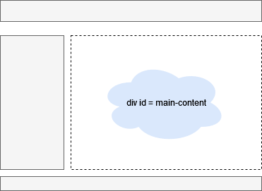

# QuCface

QuCface is a user interface to communicate with QuCMixx through REST api and process the results into UI elements.
To enable an eaiser development or mainteance we define a div as a container with id = main-content, in which we display all resutls from the communiaction with Backend side. This let us to use any design or theme, in which the div container fits in it.

