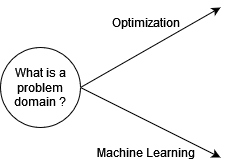

# Database
We implement the knowledge as a graph database, in which we connect the questions through possible answers until one can reach a final decision based on the series of given answers.

## Strucutre of the Database
The graph database is shown in the diagram consist of two main components: **verticies** which is connected with each other through **edges**. A vertex is a state point which represents the already known part and holds on a sepecfic question. The answer enhance the necessary knowledge to step forward and derive a final recommendation which technology to use. Hence, a vertex is a question about a specfic statement, the user should answer to navigate forward. We have different type of questions. Each question has a unique name which is used in search and navigate process and a type which denotes the type/form of the answer, i.e. single choice question or number or text answer...etc. `question` type differs from `problemClass`, `Formulation`, and `algorithm` that it contains a descritpion which indicates the title of the question. Other type has always a fixed title like `Which algorithm do you want to use` for `algorithm`. An answer element, which connects two verticies, has a unique name, description as pair of sentences describing the answer in details, and hint. hint text helps users when they have no clue if this option is the desired one by comparing all the hints' answers with a given small text from the user.

## Mapping the knowledge into the graph elements

If you would like to add new information about new cases, we need to transform the logical statements into graph-based elements as strucutred in the database

### Simple Statement
A statement is a simple sentence which can hold the value true/false at specifc point of time under a set of conditions. When the statement is valid for all possible conditions then it becomes a fact which is always truth. We can turn the statement by asking about the context of it. We consider this example
`optimization is a problem domain`
can be turned to
`What is a problem domain ?` and the answer would be `Optimization`
In this case, we map the question into a vertex with an edge going out form it to the next state.

We can inductively apply this with logical operators (and, or, not)

`optimization is a problem domain and my optimization use case is vehicle routing`

`optimization is a problem domain or machine learning is vehicle routing`

`optimization is not a problem domain`

Hence, for a set of facts retrived from each published compartive expirment we split the text into the statements connected with their logical opertaors, and map each statement into the graph database

NOTE: Edge must have an outgoing and ingoing verticies. That's why you can add an answer without knowing the next possible question or decision might come up.